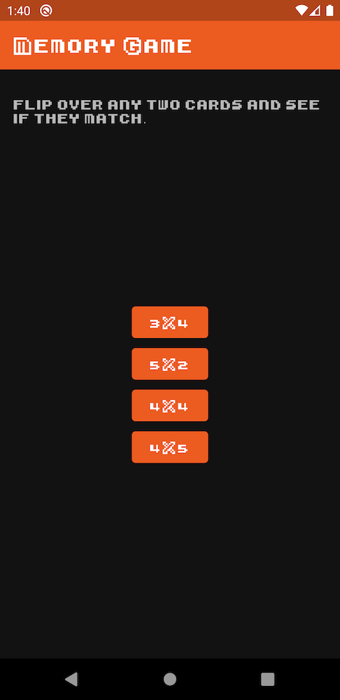
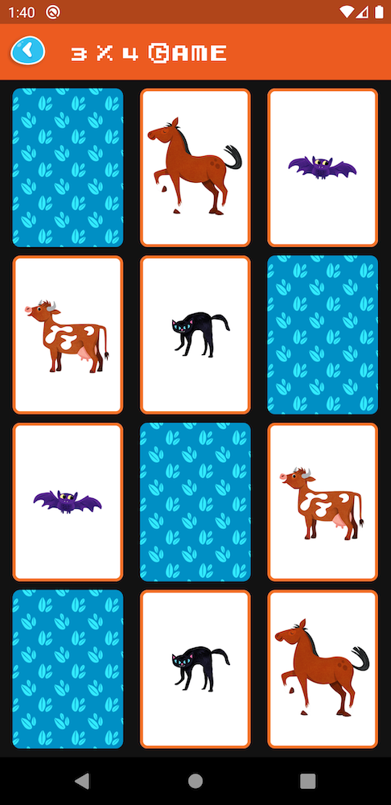

# Memory Game Challenge

## Getting Started

These instructions will get you a copy of the project up and running on your local machine for development and testing purposes.

### Prerequisites

Android Studio 3.6.1

## Building

In order to build the application, run the following command

```
./gradlew assemble
```

## Screenshots





## Authors

* **Ivan Nariño Del Castillo** - [About me](https://ivannarino.github.io)


## License

This project is licensed under the MIT License.
